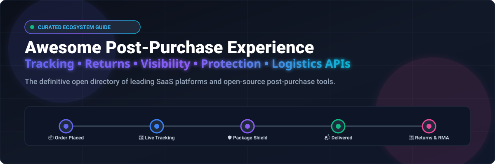

# 📦 Awesome Post-Purchase Experience Platform

  
  
  
  
  
  
  

  

> 🚚 **A curated ecosystem of SaaS products and open-source software for post-checkout customer experience, real-time shipment visibility, automated order tracking, reverse logistics, package protection, and delivery notifications.**

---

## 📑 Table of Contents

- [🎯 Overview & SEO Keywords](#-overview)
- [☁️ SaaS & Hosted Platforms](#️-saashosted-platforms)
  - [📊 Sector Market Size & Dynamics](#-sector-market-size--dynamics)
  - [🏆 SaaS Platforms Matrix](#-saas-platforms-matrix)
- [🔓 Open-Source GitHub Projects](#-open-source-github-projects)
- [🏗️ Architectural Stacks for Self-Hosted Post-Purchase](#️-architectural-stacks-for-self-hosted-post-purchase)
- [🤝 How to Contribute](#-how-to-contribute)
- [📈 Star History](#-star-history)
- [⚖️ Disclaimer](#️-disclaimer)

---

## 🎯 Overview

The post-purchase stage is the single most critical touchpoint for building customer retention, boosting customer lifetime value (LTV), and reducing costly **WISMO** ("Where Is My Order?") support tickets. This repository tracks both category-leading SaaS solutions and modular open-source building blocks that enable direct-to-consumer (DTC) brands, omnichannel retailers, and developers to craft seamless post-checkout journeys.

**Core Functional Domains:**
- 🚚 **Order Tracking & Shipment Visibility:** Multi-carrier parcel tracking, tracking webhooks, delivery milestone sync, and predictive delivery dates.
- 🎨 **Branded Tracking Experiences:** Custom subdomains, real-time interactive tracking maps, product recommendations, and post-purchase marketing.
- 🔔 **Proactive Notifications:** Automated transactional SMS, WhatsApp alerts, push updates, and delivery exception alerts.
- 🔄 **Returns & Exchanges (RMA):** Self-service return portals, instant exchanges, QR code drop-offs, store credit incentives, and return policy engines.
- 🛡️ **Package Protection & Shipping Insurance:** Merchant and consumer-funded package shielding against theft, loss, and transit damage.
- ⚙️ **Workflow Orchestration & Reverse Logistics:** Carrier rate shopping, return label generation, warehouse restock automation, and refund disbursement.

---

## ☁️ SaaS/Hosted Platforms

### 📊 Sector Market Size & Dynamics

> 📈 **Market Size & Fragmentation:** The global Post-Purchase Customer Experience & E-commerce Operations Software market is estimated at **$1.8B – $2.5B+ (within the broader $60B+ global E-commerce Logistics & Reverse Logistics sector)**, expanding at a rapid compound annual growth rate (**CAGR of 15% – 20%**). The sector is currently **moderately to highly fragmented** across tracking visibility, returns management, package protection, and notification automations, with ongoing consolidation led by scaled multi-product champions (such as Auctane/ShipStation, Loop Returns, Route, Narvar, and AfterShip).

### 🏆 SaaS Platforms Matrix

| Platform | Company Valuation / Revenue Scale | Starting Pricing | Free Tier / Trial Limits | Core Focus & Features |
| :--- | :--- | :--- | :--- | :--- |
| **ShipStation** | ~$6.6B Valuation (Auctane) / ~$1B+ Revenue | Starts at $14.99/mo (Starter plan, up to 50 shipments/mo) | 30-day free trial with full platform access (no credit card required) | Leading shipping and order fulfillment platform offering multi-carrier label generation, real-time tracking, customer notifications, and automated ecommerce logistics. |
| **Route** | ~$1.25B Valuation (Unicorn, $200M Series B) / ~$100M+ ARR | Starts at $0/mo for merchants (funded via optional shopper protection fee of 2%–2.5%, min. $0.98) | Free forever for merchants: unlimited visual tracking & self-service claim portal at $0 software fee | Visual post-purchase platform providing universal package tracking, AI delivery predictions, shopper-funded shipping protection, and customer claims resolution. |
| **Narvar** | ~$1.0B+ Valuation (Enterprise leader, Accel/Salesforce) / ~$100M+ ARR | Starts at ~$200/mo (SMB entry) / Custom enterprise contracts ($20k–$50k+/yr) | No free forever plan; tailored demo and pilot evaluation sandbox upon sales discovery | Enterprise-grade post-purchase journey platform providing branded tracking pages, proactive SMS/email delivery alerts, digital returns, and exchange optimization. |
| **Shippo** | ~$1.0B Valuation (Series E Unicorn) / ~$60M–$80M Revenue | Starts at $19/mo (Pro plan, up to 200 labels/mo with custom branding & automation) | Free forever plan: $0/mo Starter plan (up to 30 shipping labels/mo with carrier discounts); 30-day trial on Pro | Multi-carrier shipping and tracking API platform connecting global retailers to discounted postal rates, automated label workflows, and branded tracking pages. |
| **Sendcloud** | ~$500M–$750M Valuation (Raised $177M+, SoftBank) / ~$50M+ Revenue | Starts at €28/mo (~$30/mo, Lite plan + €0.10/label) | Free forever plan: €0/mo for shipping with Sendcloud pre-negotiated carrier rates; 14-day trial on paid plans | European all-in-one shipping platform offering multi-carrier shipping automation, branded localized tracking, and streamlined international return portals. |
| **AfterShip** | ~$500M+ Valuation (Series B $66M, Tiger Global) / ~$60M–$80M ARR | Starts at $11/mo (Essentials plan, 100 shipments/mo; overage $0.08/shipment) | Free forever plan: 50 shipments/mo with 1,100+ carrier tracking & basic page; 7–14 day free trial on paid plans | Global shipment tracking and post-purchase customer experience suite supporting 1,100+ carriers, AI delivery predictions, branded tracking, and automated returns. |
| **Happy Returns** | ~$465M Valuation (Acquired by UPS from PayPal) / ~$50M–$100M Revenue | Starts at ~$500/mo (Plus subscription) + variable Return Bar fee ($1.50–$3.50/return) | No free forever plan; custom enterprise pilot and sandbox testing during merchant onboarding | Box-free in-person returns network with 10,000+ Return Bar locations across the US, offering frictionless customer exchanges and aggregated reverse logistics. |
| **Loop Returns** | ~$350M–$500M Valuation (Series B $65M, CRV) / ~$40M–$60M ARR | Starts at $155/mo (Essential plan, up to 1,000 returns/year) | Free forever plan: Checkout+ tier ($0/mo software fee, shopper-funded return coverage for domestic US/CA) | Shopify-first returns and exchange platform focused on retaining revenue through instant exchanges, store bonus credit, warranty claims, and return automation. |
| **parcelLab** | ~$300M–$500M Valuation (Raised $112M, Insight Partners) / ~$30M–$50M Revenue | Starts at ~$500/mo (Standard entry tier) / Enterprise volume-based annual contracts | No free forever core plan; 14-day free trial for AI Commerce Visibility (1,000 credits); POC via sales demo | Enterprise post-purchase platform providing proactive delivery exception monitoring, branded customer communication journeys, and returns orchestration. |
| **Easyship** | ~$100M–$150M Valuation (Raised $24M+) / ~$20M–$30M Revenue | Starts at $29/mo (Plus plan, up to 500 shipments/mo) | Free forever plan: $0/mo (up to 50 shipments/mo with 50+ carrier integrations); 14-day trial on Plus plan | Global shipping and fulfillment platform providing checkout tax/duty calculation, 250+ carrier rates, tracking portals, and reverse logistics. |
| **Parcel Perform** | ~$80M–$120M Valuation (Raised $20M+, Cambridge Capital) / ~$15M–$25M Revenue | Starts at ~$500/mo (Data & Visibility tier) / Custom enterprise quoting | No free forever core plan; 14-day trial for AI Commerce Visibility (1,000 credits); pilot sandbox via demo | AI-powered delivery experience and parcel tracking intelligence platform standardizing data across 1,000+ global carriers with SLA analytics. |
| **17TRACK** | ~$50M–$100M Valuation (Bootstrapped, 100M+ users) / ~$15M–$25M Revenue | Starts at $9/mo (Basic merchant plan, 200 shipments/mo) / API quota from $28/year | Free forever plan: 50 shipments/mo on merchant app + 100 free tracking API quota calls/mo (refreshed monthly) | High-volume global multi-carrier shipment tracking network with tracking APIs, webhooks, and branded merchant tracking apps covering 3,500+ carriers. |
| **Redo** | ~$50M–$100M Valuation (Raised $10M+, Defy.vc) / ~$10M–$20M ARR | Starts at $0/mo for core returns portal (shopper coverage model at ~$1.98/order) / Add-ons from $10–$99/mo | Free forever core plan: unlimited return portal and self-service exchanges at $0 software fee; free Order Editing tool | Shopify returns management, package protection, and order management platform offering shopper-funded free returns and uncapped order editing. |
| **ReturnGO** | ~$40M–$60M Valuation (Raised $10M+) / ~$8M–$15M ARR | Starts at $23/mo (Shopify Starter) / $147/mo (Premium plan) | 14-day free trial with full access to automated returns, exchange portal, and custom return policies | AI-driven sustainable returns and exchange platform offering automated self-service returns, store credit incentives, product warranties, and gift returns. |
| **Wonderment** | ~$20M–$40M Valuation (Acquired by Loop Returns) / ~$5M–$10M ARR | Starts at $99/mo (Essential plan, covers up to 1,000 shipments/mo) | 14-day free trial on Shopify (full access to core tracking & notification automations, no credit card required) | Proactive order tracking and delivery notification engine for Shopify that alerts brands to shipping delays, carrier stalls, and delivery milestones. |
| **Ship24** | ~$20M–$40M Valuation (Privately held) / ~$5M–$10M Revenue | Starts at $3.90/mo (Essential All-in-One tracking) / $39/mo (Tracking API starter) | Free forever plan: 10 shipments/mo (All-in-One) + 100 free API calls/mo / 100-shipment first-month bonus | Global multi-carrier tracking API and tracking portal provider offering automated parcel status webhooks and cross-border customs tracking. |
| **Malomo** | ~$15M–$30M Valuation (Acquired by Redo) / ~$5M–$8M ARR | Starts at $49/mo (Lite plan, up to 1,000 shipments/mo) | No free forever plan; 14-day to 30-day trial available via partner promotions / sales demo sandbox | Post-purchase marketing platform turning package tracking pages into high-converting branded consumer experiences with Klaviyo and Attentive integrations. |
| **WeSupply** | ~$15M–$30M Valuation (Bootstrapped / Seed) / ~$3M–$7M ARR | Starts at $75/mo (Grow plan, up to 2,500 shipments/mo) | 14-day free trial with full access to order tracking, notifications, and returns features (no credit card required) | Complete ecommerce post-purchase suite unifying order tracking, proactive SMS/email notifications, automated returns, and store pickup management. |
| **Track123** | ~$10M–$20M Valuation (High-growth SaaS) / ~$3M–$6M ARR | Starts at $9/mo (Growth plan, up to 300 shipments/mo) | Free forever plan: 50 shipments/mo with real-time tracking, branded tracking page, and email notifications | Shopify-focused order tracking and shipment visibility app with multilingual branded tracking pages, dropshipping carrier mapping, and buyer notifications. |
| **Ordertracker** | ~$5M–$15M Valuation (Privately held) / ~$1M–$4M Revenue | Starts at $9/mo (Shopify starter, 200 shipments/mo) / $29/mo (API starter, 500 shipments/mo) | Free forever plan: 25 shipments/mo with unlimited lookups and web widget; 7-day free trial for Shopify app | Multi-carrier package tracking platform and API aggregating 600+ international carriers for ecommerce stores and freight visibility. |

---

## 🔓 Open-Source GitHub Projects

Explore open-source ecommerce engines, event streams, workflow orchestrators, returns frameworks, tracking libraries, and notification services that power fully customizable self-hosted post-purchase architectures. Entries are sorted descending by GitHub star counts.

### [n8n](https://github.com/n8n-io/n8n) 

Source-available workflow automation platform useful for orchestrating order events, carrier updates, customer notifications, returns approvals, refunds, and ecommerce integrations.

### [Grafana](https://github.com/grafana/grafana) 

Open-source visualization platform suitable for monitoring shipment events, delivery SLAs, carrier performance, return volumes, and API health.

### [Apache Superset](https://github.com/apache/superset) 

Enterprise open-source data exploration and visualization platform suitable for high-scale ecommerce delivery analytics and returns dashboards.

### [NocoDB](https://github.com/nocodb/nocodb) 

Open-source smart spreadsheet-database interface for managing order status, shipment logs, reverse logistics, and post-purchase resolution queues.

### [Twenty](https://github.com/twentyhq/twenty) 

Modern open-source CRM platform providing unified customer timelines, order histories, post-purchase interactions, and support ticket integration.

### [Odoo Community](https://github.com/odoo/odoo) 

Open-source suite of business apps including CRM, Sales, Inventory, Delivery Operations, and Reverse Logistics management.

### [Metabase](https://github.com/metabase/metabase) 

Open-source business intelligence platform useful for visualizing delivery timelines, carrier exception rates, return reasons, and post-purchase KPIs.

### [Apache Airflow](https://github.com/apache/airflow) 

Open-source workflow orchestration platform useful for scheduling shipment data pipelines, order sync batching, customer communication jobs, and analytics ingestion.

### [ToolJet](https://github.com/ToolJet/ToolJet) 

Open-source low-code framework to build internal operations tools for order tracking, shipment exceptions, customer support, and warehouse fulfillment.

### [Appsmith](https://github.com/appsmithorg/appsmith) 

Open-source low-code platform suitable for rapidly building internal shipment monitoring, order resolution, returns management, and customer support dashboards.

### [Novu](https://github.com/novuhq/novu) 

Open-source notification infrastructure for multi-channel customer notifications across email, SMS, push, and in-app based on order and delivery events.

### [ERPNext](https://github.com/frappe/erpnext) 

Open-source ERP system with end-to-end sales order processing, delivery note creation, stock replenishment, return handling, and accounting integration.

### [Directus](https://github.com/directus/directus) 

Open-source data platform and instant REST/GraphQL API layer useful for creating custom customer-facing post-purchase portals backed by SQL databases.

### [Keycloak](https://github.com/keycloak/keycloak) 

Open-source identity and access management platform useful for powering secure customer accounts, order lookup auth, and self-service return portals.

### [Chatwoot](https://github.com/chatwoot/chatwoot) 

Open-source omnichannel customer engagement suite for handling post-purchase inquiries, order status chats, and delivery support tickets.

### [Medusa](https://github.com/medusajs/medusa) 

Open-source composable commerce platform with robust built-in order management, automated return workflows, exchanges, item claims, and shipment fulfillment.

### [ntfy](https://github.com/binwiederhier/ntfy) 

Open-source HTTP-based pub-sub push notification service that delivers real-time operational alerts for delivery exceptions and urgent logistics events.

### [Apache Kafka](https://github.com/apache/kafka) 

Open-source distributed event-streaming platform useful for large-scale event architectures processing real-time shipment updates, carrier webhooks, and delivery notifications.

### [changedetection.io](https://github.com/dgtlmoon/changedetection.io) 

Open-source website change monitoring tool adaptable for tracking carrier status pages, supplier inventory updates, and delivery portals without official APIs.

### [Budibase](https://github.com/Budibase/budibase) 

Open-source low-code platform for building custom internal tools, logistics management panels, and returns verification applications.

### [Bagisto](https://github.com/bagisto/bagisto) 

Open-source Laravel-based ecommerce framework with multi-warehouse inventory, shipment tracking, RMA capabilities, and order status notifications.

### [Activepieces](https://github.com/activepieces/activepieces) 

Open-source business automation platform for integrating ecommerce webhooks, carrier status alerts, Slack/email notifications, and CRM updates.

### [Prefect](https://github.com/prefecthq/prefect) 

Modern open-source data workflow orchestration platform designed to schedule, monitor, and react to post-purchase data pipelines.

### [Node-RED](https://github.com/node-red/node-red) 

Low-code flow-based programming tool for event-driven applications, connecting carrier webhooks, IoT tracking sensors, and transactional notification alerts.

### [TimescaleDB](https://github.com/timescale/timescaledb) 

Open-source time-series PostgreSQL engine for storing high-frequency shipment GPS tracking scans, status changes, and transit telemetry.

### [Saleor](https://github.com/saleor/saleor) 

Open-source headless commerce platform with GraphQL APIs, webhook event triggers, order lifecycle management, and flexible returns handling.

### [Listmonk](https://github.com/knadh/listmonk) 

High-performance, self-hosted newsletter and transactional mailing service for post-purchase delivery updates, review requests, and transactional emails.

### [Temporal](https://github.com/temporalio/temporal) 

Open-source durable execution and workflow orchestration platform for long-running post-purchase lifecycles (multi-day deliveries, return escrows, refund workflows).

### [PostgreSQL](https://github.com/postgres/postgres) 

Open-source relational database suitable for storing orders, tracking numbers, shipment events, return requests, exchanges, refunds, and customer interactions.

### [Apprise](https://github.com/caronc/apprise) 

Lightweight multi-platform push notification library sending alerts via 80+ messaging services for shipment delays and delivery updates.

### [Dagster](https://github.com/dagster-io/dagster) 

Cloud-native open-source data orchestrator for tracking order lifecycle states, carrier latency metrics, and data warehouse synchronization.

### [Spree Commerce](https://github.com/spree/spree) 

Open-source headless Ruby on Rails commerce platform providing flexible order states, RMA processing, shipment management, and refunds.

### [RabbitMQ](https://github.com/rabbitmq/rabbitmq-server) 

Widely deployed open-source message broker for asynchronous post-purchase event processing, webhook fan-out, and reliable notification queuing.

### [Reaction Commerce](https://github.com/reactioncommerce/reaction) 

API-first modular commerce engine built on Node.js and GraphQL for scalable order processing and fulfillment extensions.

### [Magento Open Source](https://github.com/magento/magento2) 

Enterprise-grade open-source ecommerce platform with comprehensive order management, RMA workflows, carrier integrations, and shipment tracking.

### [Frappe Framework](https://github.com/frappe/frappe) 

Full-stack open-source web application framework powering ERPNext, ideal for building bespoke order management and customer support portals.

### [WooCommerce](https://github.com/woocommerce/woocommerce) 

Open-source customizable ecommerce platform for WordPress, extensible with hundreds of shipment tracking, return portal, and carrier plugins.

### [Mautic](https://github.com/mautic/mautic) 

Open-source marketing automation engine for automated post-purchase drip sequences, customer feedback collection, and delivery surveys.

### [Flowable](https://github.com/flowable/flowable-engine) 

Compact and highly efficient open-source BPMN business process engine for orchestrating return approvals, RMA escalations, and refund rules.

### [PrestaShop](https://github.com/PrestaShop/PrestaShop) 

Popular open-source ecommerce solution supporting customer messaging, order status tracking, return slips, and third-party carrier add-ons.

### [Sylius](https://github.com/Sylius/Sylius) 

Modern open-source PHP ecommerce framework built on Symfony, tailored for customized order states, shipment tracking, and return workflows.

### [Vendure](https://github.com/vendure-ecommerce/vendure) 

Modern headless GraphQL ecommerce framework with extensible order fulfillment, shipping method resolvers, and customer communication plugins.

### [OpenCart](https://github.com/opencart/opencart) 

Lightweight open-source ecommerce system featuring order tracking, returns management (RMA), customer email notifications, and shipping modules.

### [Traccar](https://github.com/traccar/traccar) 

Open-source GPS tracking system supporting real-time fleet, parcel, and vehicle telemetry tracking with extensive carrier hardware compatibility.

### [InvenTree](https://github.com/inventree/InvenTree) 

Open-source inventory and stock management system with order tracking, item allocation, and returns receipt processing.

### [Apache NiFi](https://github.com/apache/nifi) 

Open-source data distribution and processing platform for managing complex real-time logistics data flows between ERPs, carriers, and databases.

### [Kill Bill](https://github.com/killbill/killbill) 

Open-source subscription billing and payments platform managing recurring customer charges, refund processing, and post-purchase credit adjustments.

### [Camunda](https://github.com/camunda/camunda) 

Process orchestration platform for modeling and automating complex end-to-end post-purchase journeys, shipping exceptions, and return authorizations.

### [Shopware](https://github.com/shopware/shopware) 

Open-source headless commerce platform offering flow builder automations for delivery triggers, status emails, and return handling.

### [OpenBoxes](https://github.com/openboxes/openboxes) 

Open-source supply chain and inventory management system designed for healthcare and logistics fulfillment, tracking shipments from source to destination.

### [EasyPost Python Client](https://github.com/easypost/easypost-python) 

Official open-source Python client for EasyPost API, enabling multi-carrier rating, label printing, address verification, and tracking webhooks.

### [Shippo Python SDK](https://github.com/goshippo/shippo-python-client) 

Official Python client library for Shippo multi-carrier shipping, rate comparison, tracking updates, and return label generation.

### [AfterShip Node.js SDK](https://github.com/AfterShip/aftership-sdk-nodejs) 

Official JavaScript/Node.js SDK for AfterShip Tracking API, providing tracking number creation, checkpoint retrieval, and webhook handling.

### [AfterShip Python SDK](https://github.com/AfterShip/aftership-sdk-python) 

Official Python client for AfterShip API, allowing automated tracking checkpoint updates and carrier status queries.

### [Postal](https://github.com/postal-server/postal) 

Fully featured open-source mail server designed specifically for high-reliability transactional delivery emails, tracking links, and shipping notices.

### [TrackingMore Python SDK](https://github.com/TrackingMore/trackingmore-sdk-python) 

Open-source Python SDK for TrackingMore multi-carrier tracking API, handling real-time parcel updates across 1,200+ carriers.

### [17TRACK Python SDK](https://github.com/17track/17track-sdk-python) 

Official Python SDK for 17TRACK API, providing batch tracking registration and delivery status polling.

---

## 🏗️ Architectural Stacks for Self-Hosted Post-Purchase

A complete production-ready post-purchase system can be built by combining modular open-source components:

- 🛒 **Commerce & Order Foundation:** Use [Medusa](https://github.com/medusajs/medusa), [Saleor](https://github.com/saleor/saleor), [WooCommerce](https://github.com/woocommerce/woocommerce), [Vendure](https://github.com/vendure-ecommerce/vendure), or [ERPNext](https://github.com/frappe/erpnext) for order lifecycle states, customer records, and refund hooks.
- 🔄 **Returns & Reverse Logistics:** Implement [Medusa Returns](https://github.com/medusajs/medusa) or model custom approval chains with [Temporal](https://github.com/temporalio/temporal) or [Camunda](https://github.com/camunda/camunda).
- 🚚 **Tracking & Carrier Integration:** Connect multi-carrier APIs ([Shippo SDK](https://github.com/goshippo/shippo-python-client), [EasyPost Client](https://github.com/easypost/easypost-python), [AfterShip SDK](https://github.com/AfterShip/aftership-sdk-nodejs)) and track fleets with [Traccar](https://github.com/traccar/traccar).
- ⚡ **Event Streaming & Time-Series Scans:** Stream high-frequency carrier checkpoint scans via [Apache Kafka](https://github.com/apache/kafka) or [RabbitMQ](https://github.com/rabbitmq/rabbitmq-server) into [TimescaleDB](https://github.com/timescale/timescaledb) / [PostgreSQL](https://github.com/postgres/postgres).
- 🔁 **Automation & Webhooks:** Orchestrate status updates, carrier alerts, and customer notifications using [n8n](https://github.com/n8n-io/n8n) or [Activepieces](https://github.com/activepieces/activepieces).
- 📣 **Customer Notifications & Communications:** Send automated transactional emails and push alerts using [Novu](https://github.com/novuhq/novu), [Listmonk](https://github.com/knadh/listmonk), [Postal](https://github.com/postalserver/postal), [Apprise](https://github.com/caronc/apprise), or [ntfy](https://github.com/binwiederhier/ntfy).
- 💬 **Customer Engagement & CRM:** Manage post-purchase support and delivery conversations with [Chatwoot](https://github.com/chatwoot/chatwoot) and [Twenty CRM](https://github.com/twentyhq/twenty).
- 📊 **Analytics & Operations Dashboards:** Build operational visibility and carrier SLA monitoring with [Grafana](https://github.com/grafana/grafana), [Metabase](https://github.com/metabase/metabase), [Apache Superset](https://github.com/apache/superset), [Appsmith](https://github.com/appsmithorg/appsmith), or [ToolJet](https://github.com/ToolJet/ToolJet).

---

## 🤝 How to Contribute

Contributions and suggestions are warmly welcomed! To contribute:

1. Fork the repository.
2. Add or update tools in `README.md` following the established format.
3. For SaaS entries, provide official documentation links, exact starting prices, free tier/trial limits, and estimated market scale.
4. For Open-Source entries, include the official GitHub repo link and social star badge.
5. Submit a descriptive Pull Request.
6. ⭐ Star the repository if you find it helpful!

---

## 📈 Star History

---

## ⚖️ Disclaimer

- This repository is a community-curated directory compiled for educational, research, and technical evaluation purposes.
- Mention of companies, products, or trademarks does not imply endorsement or affiliation.
- Shipment tracking uptime and scan accuracy depend on third-party carrier infrastructure and APIs.
- Returns, refunds, package insurance, and payment processing must adhere to applicable regional commercial, tax, and consumer-protection regulations.

---

  Made with ❤️ for ecommerce operators, developers, logistics engineers, and post-purchase experience architects worldwide.

